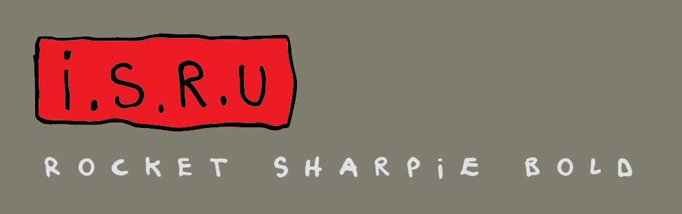
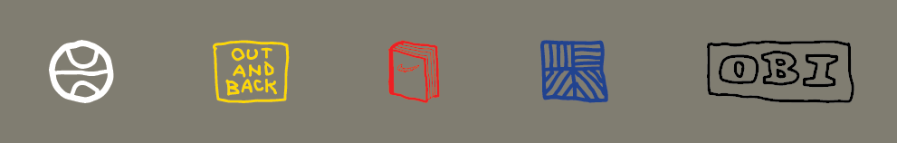
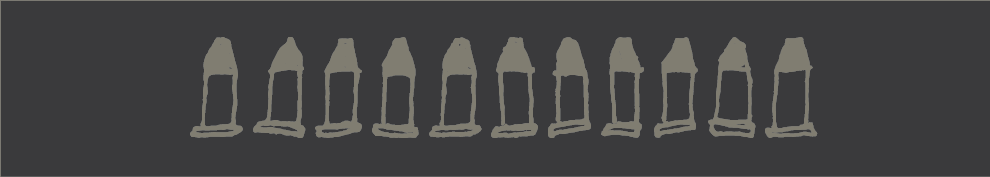
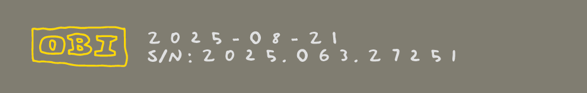

# ISRU Rocket Sharpie Bold

**"Inspired" by Tom Sachs' handwriting**

A dynamic display font useful for ISRU summercamp and beyond, featuring contextual alternates that bring the organic variability of Tom's Sharpie to digital typography.

**Created by @omgitsu**  
**S/N: 2025.063.27251**

## Features

### Contextual Alternates (calt)
The font includes intelligent contextual alternates that automatically vary letter forms to simulate natural handwriting:

- **Lowercase letters [a-z]**: Pseudorandomly alternate between lowercase, capital, stylistic set 01, and stylistic set 02
- **Numbers [0-9]**: Pseudorandomly alternate between base form and stylistic sets 01, 02, and 03

This creates natural-looking text variation without manual intervention.

### Standard Ligatures

Special ligature sequences automatically replace standard glyphs:

- `[ISRU]`
- `[NIKECRAFT]`
- `[NIKELOGO]`
- `[OUTANDBACK]`
- `[OBI]`
- `[TEN]`
- `[WALL]`
- `[READ]`


### Bullet Points

The font includes 10 bullet points (•) because of course there are.
- **macOS**: Option + 8
- **Windows**: Alt + 0149 (using numeric keypad)

### Stylistic Sets
- **Stylistic Set 01 & 02**: Alternate glyphs for visual variety
- **Stylistic Set 03**: Repeat of capital glyphs (used for programming the calt feature)

## Character Set

All glyphs are based on scans of Tom Sachs' works. Some characters are "franken-glyphs" or best guesses where original references weren't available:

**Currencies**: $, €, £, ¥  
**Fractions**: ½, ¼, ¾  
**Punctuation**: ¿, ¡, ~, ‽, ™, ©, ®

## Development

- Developed in FontLab 8
- Source files are included in this repository
- Node.js script included to compile OpenType features from source files

## Usage Examples

### CSS Implementation
```css
@font-face {
  font-family: 'ISRU Rocket Sharpie Bold';
  src: url('path/to/ISRURocketSharpieBold.woff2') format('woff2'));
  font-weight: bold;
  font-style: normal;
}

.handwritten {
  font-family: 'ISRU Rocket Sharpie Bold', sans-serif;
  font-feature-settings: "calt" 1, "liga" 1;
}
```

### HTML Demo
```html
<div class="handwritten">
  <h1>Welcome to [ISRU] Summer Camp</h1>
  <p>This is how the contextual alternates work - notice how each letter 
     varies naturally as you type, creating authentic handwritten appeal.</p>
  <p>Numbers also vary: 1234567890 vs 1234567890</p>
  <p>Special ligatures: [NIKECRAFT] [WALL] [READ] [TEN]</p>
</div>
```

### Stylistic Set Usage
```css
/* Enable specific stylistic sets */
.style-set-01 {
  font-feature-settings: "ss01" 1;
}

.style-set-02 {
  font-feature-settings: "ss02" 1;
}

.all-features {
  font-feature-settings: "calt" 1, "liga" 1, "ss01" 1, "ss02" 1;
}
```

## Contributing

Pull requests are welcome, especially if you have scans of the franken-glyphs mentioned above. Help us improve the authenticity of the currency symbols, fractions, and uncommon punctuation marks.

## Sources

The font has been created with FontLab 8.  A Glyphs export is also provided - but it is untested because I don't have Glyphs. 


### Building the `calt` from source

1. Open the source files in the `/scripts` directory
2. Run the Node.js compilation script:
   ```bash
   node compiler.js > calt.fea
   ```

## License

This font is released under the [SIL Open Font License 1.1](https://scripts.sil.org/OFL). You are free to use, study, modify, and redistribute this font for any purpose, commercial or non-commercial. Fork it, hack it, make it better – no strings attached.

## Inspiration

This font pays homage to Tom Sachs' distinctive Sharpie style, for artistic purposes, and for various Summer Camp challenges. Perfect for projects that need an authentic, handcrafted aesthetic - I guess.

---



*For ISRU summercamp and all your space program typography needs.*


## Further Links

- **[ISRU Summer Camp](https://isrucamp.com/)** - The space program that inspired this font
- **[Nikecraft](https://nikecraft)** - Tom Sachs' collaborative project with Nike
- **[Tom Sachs Studio](https://www.tomsachs.com/)** - Official studio website
- **[Tom Sachs Store](https://store.tomsachs.com/)** - Official merchandise and works


**Disclaimer**: Not officially affiliated or endorsed by Tom Sachs or his studio or Nike or whatever. This font will remain available for as long as the lawyers let me. Which is hopefully forever, but you know how lawyers are about things "inspired" by other people's work. Download it while you can! 🚀